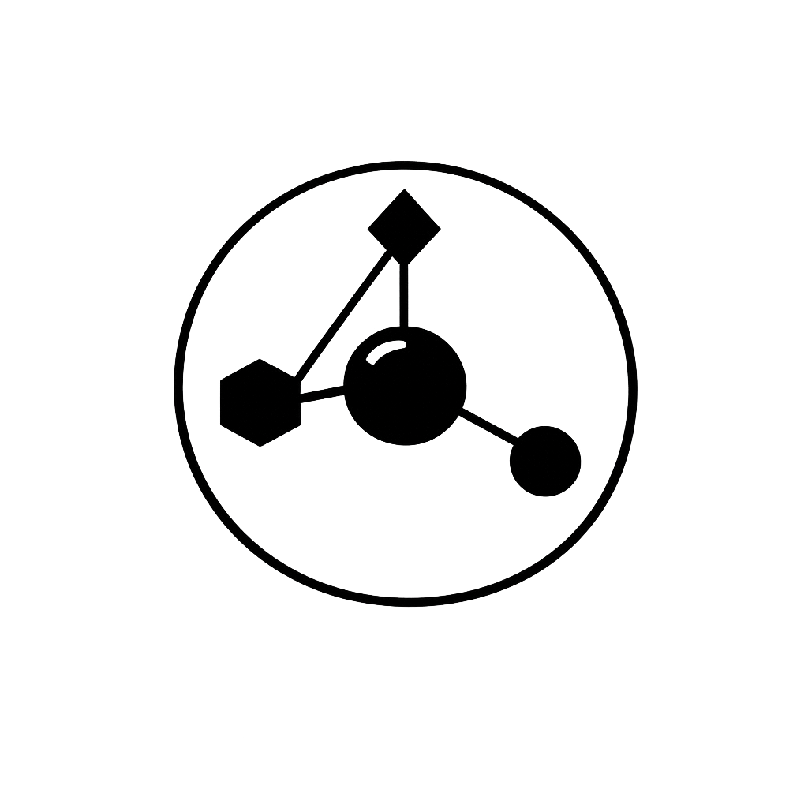

<p align="center">
  
</p>

<h1 align="center">vector-graph</h1>

<p align="center">
  <b>The radar for vibe coding.</b><br>
  Real-time 3D code knowledge graph that watches your codebase, visualizes changes, and warns AI agents about risky edits.
</p>

<p align="center">
  
  
  
  
  
</p>

<p align="center">
  
</p>

---

## What is this?

You're vibe coding with Claude / Cursor / aider. Files are changing fast. You've lost track of what the AI modified and how it affects your codebase.

**vector-graph** gives you a live 3D radar:

```bash
vector-graph ~/project --watch --serve    # start radar
# open http://localhost:5555              # see the nebula
```

Two interfaces, one brain:
- **3D Web Radar** (for humans) -- live nebula visualization in the browser
- **MCP Server** (for AI agents) -- Claude Code queries impact/risk before making changes

## Quick Start

### Install

```bash
git clone https://github.com/yusenthebot/vector-graph.git
cd vector-graph
pip install -e ".[dev]"
```

### Visualize any Python project

```bash
vector-graph ~/your/project --serve
```

### Live Radar (vibe coding mode)

```bash
# Terminal 1 — radar
vector-graph ~/your/project --watch --serve

# Terminal 2 — vibe code
claude   # or aider, cursor, etc.
```

Every file change triggers: camera fly-to, impact chain highlight, nebula glow, and change timeline update.

## Features

### Three Visualization Modes

| Mode | Key | Nodes | Edges | Use Case |
|------|-----|-------|-------|----------|
| **Arch** | `1` | Files only | Imports | Module dependency overview |
| **Logic** | `2` | Files + Functions + Classes + Methods | Calls + Imports + Extends | Call flow analysis (default) |
| **Deep** | `3` | All types (variables, decorators, properties) | All edge types | Full data flow |

All three modes pre-cached on load -- switching is instant.

### Distinct Node Shapes

Each code element has a unique 3D geometry:

| Shape | Type | Color |
|-------|------|-------|
| Flat hex disc | File | Gray |
| Cube | Class | Purple |
| Sphere | Function | Blue |
| Diamond | Method | Teal |
| Small pyramid | Variable | Light gray |
| Ring | Decorator | Pink |
| Icosahedron | ROS2 Node | Red |
| Cone | Topic | Yellow |
| Cylinder | Service | Green |

### Live Change Tracking

**Summary mode** (default):
- Compact change card with add/modify/remove counts
- Auto-generated **flow diagrams**: `[callers] -> [changed_fn] -> [callees]`
- Removed functions show syntax-highlighted old code + orphaned callers
- Impact summary with blast radius

**Detail mode**:
- Inline unified code diffs with Python syntax highlighting
- Expandable source preview per dependency
- Test suggestions (which tests to run)
- Session change frequency counter

### 3D Nebula Visualization

- Nodes grouped by package into **nebula clusters** (Three.js spheres + stardust + orbital rings)
- **Click node**: connections highlighted, everything else dims, inspector opens
- **Resizable panels**: drag sidebar/inspector edges
- **Health mode**: color by cyclomatic complexity (green -> red)
- **Tooltips**: hover any UI element for explanation

### Claude Code Integration

```bash
vector-graph --install-hook
```

Installs a `PreToolUse` hook -- checks risk before every `Edit`/`Write`:
- **LOW/MEDIUM**: silent pass
- **HIGH/CRITICAL**: one-line warning (~30 tokens)
- Server not running: silent, no error

### MCP Server (15 Tools)

```jsonc
// .mcp.json
{
  "mcpServers": {
    "vector-graph": {
      "command": "vector-graph-mcp",
      "args": ["/path/to/project"]
    }
  }
}
```

| Tool | Purpose |
|------|---------|
| `impact_preview` | Blast radius before changing a function |
| `safe_to_modify` | Risk assessment for a file |
| `suggest_tests` | Which tests to run after a change |
| `what_changed` | Session change summary |
| `dependency_check` | Would this import create a cycle? |
| `graph_query` | 8 structured query types |
| `health` | Full codebase health report |
| `complexity` | Per-function McCabe complexity |
| `cycles` | Tarjan SCC cycle detection |
| `orphans` | Unreachable code detection |
| `export` | JSON/DOT graph export |
| `impact` | Blast radius analysis |
| `context` | 360-degree symbol context |
| `query` | Symbol search |
| `detect_changes` | Changed files report |

## Usage

```bash
# 3D visualization
vector-graph ~/project --serve

# Live radar (watch + web)
vector-graph ~/project --watch --serve

# Terminal dashboard (no browser)
vector-graph ~/project --watch --tui

# CLI analysis
vector-graph ~/project --impact FunctionName
vector-graph ~/project --orphans
vector-graph ~/project --export json
vector-graph ~/project --export dot

# MCP server (stdio)
vector-graph-mcp ~/project
```

## Analysis Engine

| Capability | Method | Accuracy |
|------------|--------|----------|
| Type inference | Intra-procedural (constructor, annotation, `self.attr`) | 93% call resolution |
| Call resolution | Type-aware attribute lookup + import-scoped + global fallback | 0.95 / 0.9 / 0.5 confidence |
| Code health | McCabe cyclomatic complexity, fan-in/out, coupling/cohesion | Per-function + per-module |
| Impact analysis | BFS blast radius with depth-based risk scoring | LOW/MEDIUM/HIGH/CRITICAL |
| Change detection | AST signature comparison (params, return type, decorators, line span) | Real modifications only |
| Cycle detection | Tarjan's strongly connected components | Exact |
| Communities | Label propagation clustering | Automatic grouping |
| Execution flows | Entry point scoring + BFS trace | Full path coverage |
| ROS2 extraction | AST mining for rclpy nodes, topics, services, actions | Launch file + msg parsing |

## Architecture

```
vector_graph/
  _types.py         Frozen dataclasses (GraphNode, Edge, NodeLabel, EdgeType, ...)
  pipeline.py       9-phase analysis orchestrator

  graph/            In-memory knowledge graph
    knowledge_graph.py   Dict-based graph with 5 secondary indexes
    symbol_table.py      Symbol registry for name resolution
    resolution.py        Import-scoped + global resolution context
    protocols.py         Duck-typed GraphProtocol

  parse/            Python AST extraction (zero external deps)
    python_parser.py     AST walk -> functions, classes, imports, calls
    python_imports.py    Import path resolution
    python_types.py      Type annotation extraction

  analysis/         Query & analysis algorithms
    type_inference.py    Intra-procedural type binding
    call_graph.py        Type-aware call edge resolution
    complexity.py        McCabe complexity + health scoring
    impact.py            BFS blast radius analysis
    cycles.py            Tarjan SCC cycle detection
    community.py         Label propagation clustering
    execution_flow.py    Entry-point tracing
    suggest_tests.py     Test file recommendation
    orphan.py            Unreachable node detection
    query.py             Structured query dispatch
    export.py            JSON/DOT serialization

  watch/            File system monitoring
    file_watcher.py      Watchdog observer + incremental rebuild
    change_tracker.py    Before/after diff + source snapshots + impact

  api/              User-facing interfaces
    python_api.py        CodeGraph class + CLI entry point
    web_server.py        HTTP server + graph data API
    mcp_server.py        MCP protocol (15 tools, stdio transport)
    sse_server.py        Server-Sent Events broadcaster
    tui.py               Terminal dashboard (rich/textual)
    visualize.py         CLI output formatting
    static/              Frontend assets
      index.html         HTML shell
      graph.js           3D visualization (Three.js + 3d-force-graph)
      graph.css          Catppuccin Mocha theme

  hooks/            Claude Code integration
    install.py           PreToolUse hook installer

  ros2/             ROS2-specific extraction
    node_extractor.py    rclpy AST pattern mining
    launch_parser.py     XML launch file parsing
    msg_parser.py        .msg/.srv definition parsing
    ros2_graph.py        ROS2 overlay on knowledge graph
```

### Pipeline Phases

```
1. Walk filesystem        -> File nodes
2. Parse Python ASTs      -> Functions, classes, imports, calls
3. Register symbols       -> SymbolTable + graph nodes
3b. Resolve heritage      -> EXTENDS + DECORATES edges
3c. Type inference        -> Variable type bindings
4. Resolve imports        -> IMPORTS edges
5. Build call edges       -> CALLS edges (type-aware, 93% accuracy)
6. Detect communities     -> Label propagation clustering
7. Trace execution flows  -> Entry-point analysis
8. ROS2 extraction        -> Node/topic/service overlay
```

## Tech Stack

| Layer | Technology | Version | Purpose |
|-------|-----------|---------|---------|
| **Core** | Python stdlib `ast` | 3.10+ | AST parsing, zero external deps |
| **3D Rendering** | Three.js | r137.0 | WebGL scene, nebula geometry, lighting |
| **Force Graph** | 3d-force-graph | 1.79.1 | Force-directed layout, node interaction |
| **Syntax Highlighting** | highlight.js | 11.9.0 | Code diffs + source previews |
| **File Watching** | watchdog | 3.0+ | Filesystem event monitoring (optional) |
| **MCP Protocol** | mcp | 1.0+ | Claude Code tool integration (optional) |
| **Terminal UI** | rich / textual | latest | TUI dashboard (optional) |
| **Community Detection** | networkx | 3.0+ | Label propagation (optional) |
| **Graph Export** | pygraphviz | 1.7+ | DOT format rendering (optional) |
| **Testing** | pytest + pytest-cov | 7.0+ | 734 tests, 86% coverage |
| **Build** | hatchling | latest | PEP 517 build backend |

## Example Project

```bash
# Included taskflow demo — 6 nebulae, ~500 nodes, cycles, orphans, god classes
vector-graph examples/taskflow --serve --max-nodes 500
```

## Testing

```bash
pytest -q                          # 734 tests, ~20s
pytest --cov=vector_graph          # 86% coverage
pytest -m level0                   # data types only
pytest -m level2                   # analysis algorithms only
```

Test layers: L0 (types) -> L1 (parse) -> L2 (analysis) -> L3 (ROS2) -> L4 (watch) -> L5 (API)

## License

MIT
